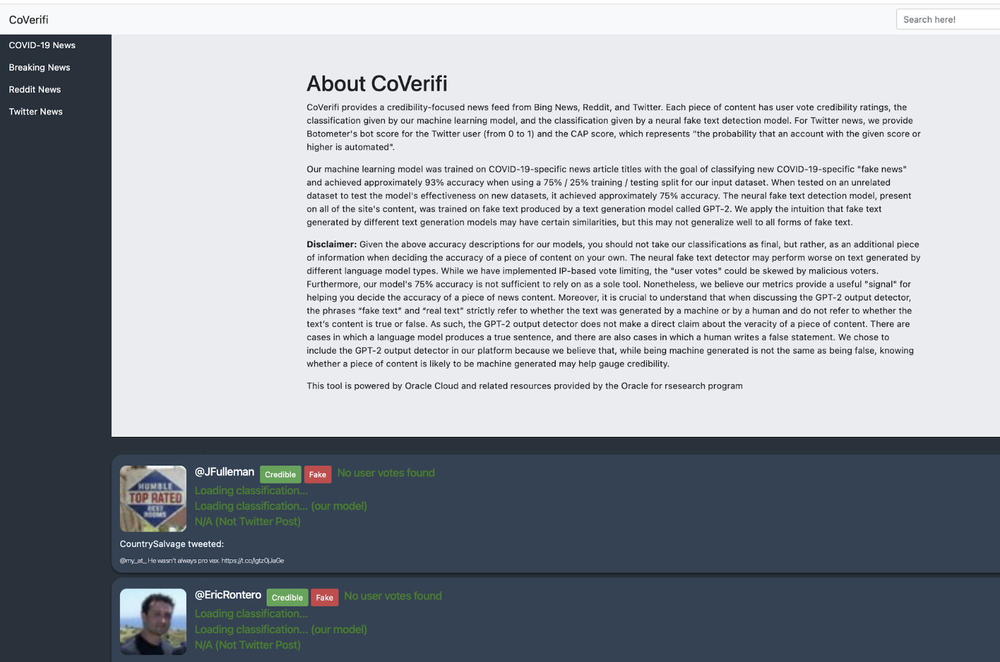
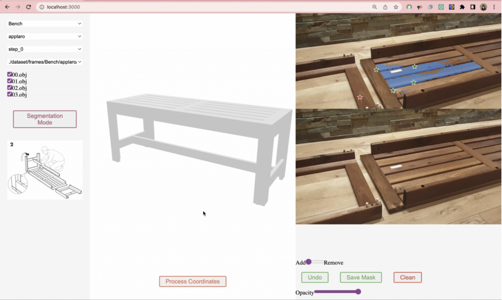
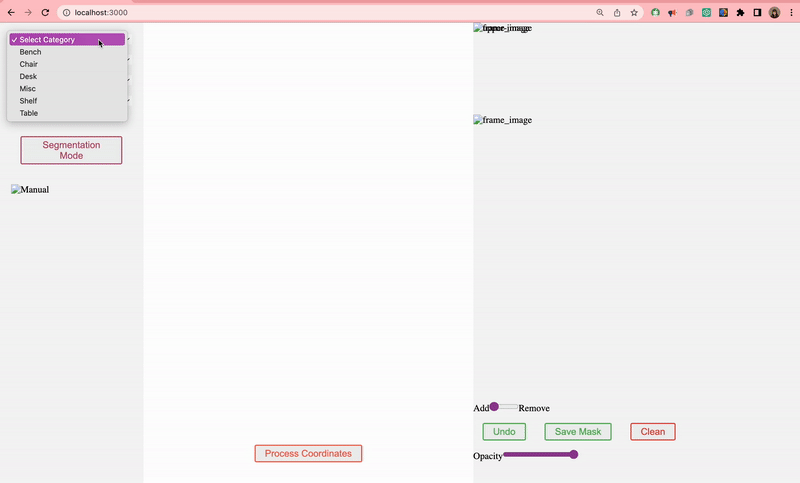
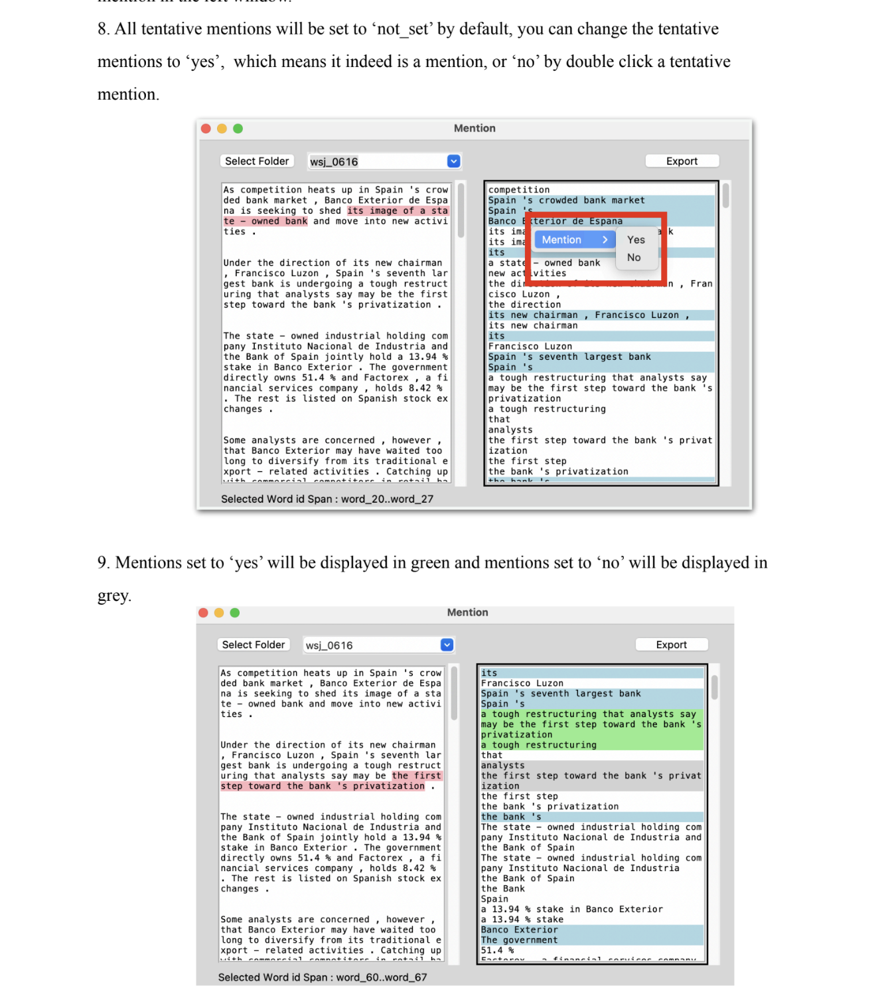
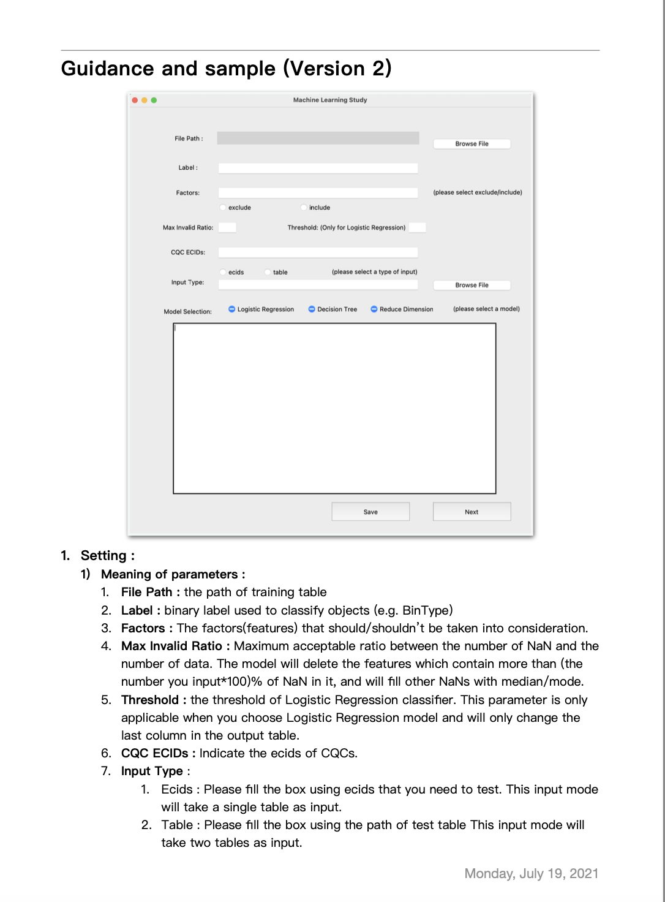

# Interfaces-Yunong

I am skilled in creating user interfaces for **web-based applications** ( React, Python, Javascript etc.) and **desktop applications** using Python Tkinter.

## Web-based Interface

I have **3** experiences in developing web-based interfaces:

### CoVerifi
(The website is currently inactive and the backend has been terminated, therefore only the static page is accessible at this time. Apologies for the inconvenience.)

<!-- Insert link http://www.coverifinews.com -->
[http://www.coverifinews.com](http://www.coverifinews.com) is a web-based application that allows users to verify the authenticity of news articles. It is developed using React, Javascript, HTML, CSS, and Python.

This interface was done during my summer research at UTAustin (2022 summer), where I was fortunate to work with Professor [Dhiraj Murthy](https://journalism.utexas.edu/faculty/dhiraj-murthy). This web-based interface extracts **real-time news** from various sources, including Reddit, Twitter, and BBC, and runs a language model in the background to provide a **credibility score** for each news item (true news or fake news). Additionally, users can sign in and leave votes for each news item, allowing us to **collect crowdsourcing data**.

<!-- Image for the interface from ./src/coverifi.png -->

### 3D Annotation Interface 

( Not yet deployed it to a publicly accessible platform.)

It has the ability to display 3D objects using Three.js in the middle of the frame on the right side. This interface assists with image segmentation and 3D projection. 

This interface is currently under development and still in progress :)

<!-- Image for the interface from ./src/3D.png -->

<!-- Video for the interface -->
[

### Just Dance Everywhere

This interface was developed during my Computer Vision course project at UTAustin. Upon opening the interface, the user's camera will activate and display the JustDance video game in the centre. The camera will capture the user's pose and utilize a pose-estimation model and scoring function to provide real-time scoring for their dance.

<!-- Gif for the interface -->

## Desktop applications

I have **2** experience in developing desktop applications that can assist individuals with no programming skills. I have wroten comprehensive documentation for each application interface.

1. This interface was done during my summer project with Professor Bonnie Webber and Lori Levin at Edinburgh. The interface is able to map data from the Information Status (ISNotes: Markert et al., 2012) and Discourse Relations (PDTB: Prasad et al., 2008; Webber et al, PDTB-3) datasets and display them in a well-formatted manner. It also has the ability to extract all NPs from the paragraphs and enables the user to annotate the data.

<!-- Image for the interface -->

2. This interface was completed during my internship at NXP Semiconductor, which enables the staff to input CSV files and labels containing data from semiconductor products. Then, the interface runs the model and provides predicted results (abnormal/normal) in the output box, along with visualizations for the results.

<!-- Image for the interface -->

